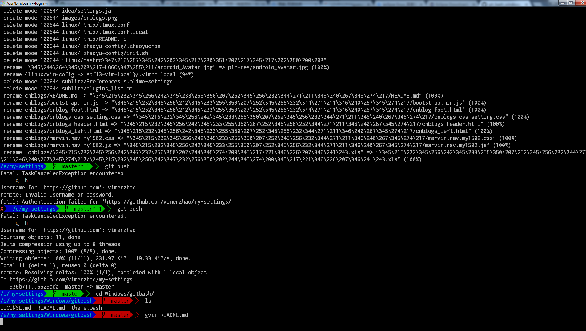
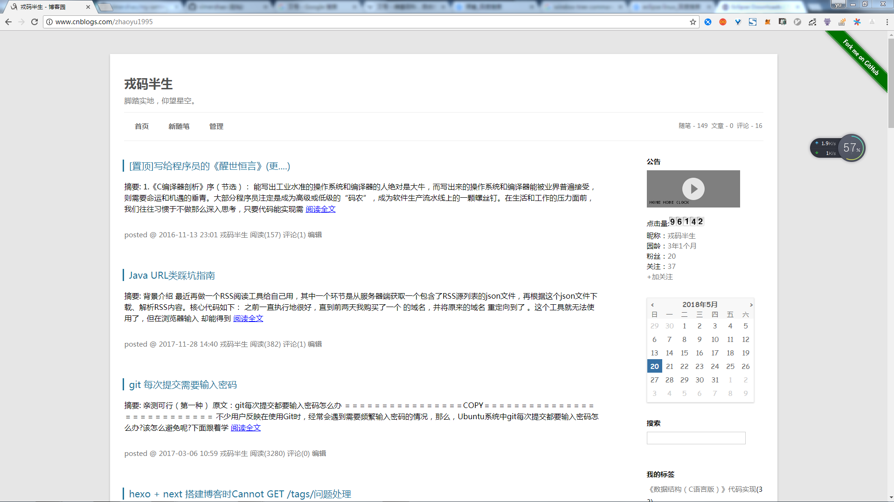

# oh-my-config
整理了的我的常用配置，方便以后迁移环境（换电脑、重装系统等）时能够快速配置。
平台相关的配置放在了系统对应目录(`Windows`和`Linux`)，其他目录的要么和系统无关（如`pic-res`），要么已经做了兼容（如`spf13-vim-local`）。

# introduction

## Windows
Window平台相关的配置：
- `xmodmap.reg`:更改键盘映射
- `VisualStudio`:VS配置，好久没用，估计过期了。
- `oh-my-gitbash`:定制主题的gitbash

oh-my-gitbash效果：

## Linux
Linux平台相关配置。

## spf13-vim-local
基于开源项目[spf13-vim](https://github.com/spf13/spf13-vim)定制的Vim配置，Windows和Linux已经配置好。

## AndroidStudio&IDEA
AndroidStudio和IDEA的配置文件。

## pic-res
一些头像、LOGO等图片

## 博客园自定义样式
博客园自定义样式，以后基本不可能维护了。效果：

## Eclipse
Eclipse配置，现在基本不用这个IDE了，也不会维护。
